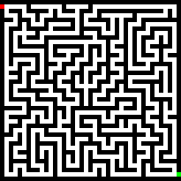
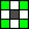

<h1 align="center">A* Algorithm</h1>
<div align="center">
    
</div>

<br />

<details open>
    <summary>Table of Contents</summary>
    <ol>
        <li>
            <a href="#about-the-project">About The Project</a>
        </li>
        <li>
            <a href="#getting-started">Getting Started</a>
            <ul>
                <li>
                    <a href="#prerequisites">Prerequisites</a>
                    <ul>
                        <li>
                            <a href="#linux">Linux</a>
                        </li>
                    </ul>
                </li>
                <li>
                    <a href="#building-the-project">Building the Project</a>
                    <ul>
                        <li>
                            <a href="#linux-1">Linux</a>
                        </li>
                    </ul>
                </li>
            </ul>
        </li>
        <li>
            <a href="#usage">Usage</a>
            <ul>
                <li>
                    <a href="#configuration">Configuration</a>
                    <ul>
                        <li>
                            <a href="#grid-file">Grid File</a>
                        </li>
                        <li>
                            <a href="#diagonal-neighbours">Diagonal Neighbours</a>
                        </li>
                        <li>
                            <a href="#distance-functions">Distance Functions</a>
                        </li>
                        <li>
                            <a href="#window-size">Window Size</a>
                        </li>
                    </ul>
                </li>
                <li>
                    <a href="#run">Run</a>
                </li>
                <li>
                    <a href="#controls">Controls</a>
                </li>
            </ul>
        </li>
    </ol>
</details>

## About The Project

The A* algorithm is a pathfinding algorithm that finds the optimal path between two points in a graph by visiting each predefined point. This project implements a simple A* algorithm visualizer. SFML is used for rendering and capturing user input.

### Built with

* [![C++][C++]](https://isocpp.org/)
* [![CMake][CMake]](https://cmake.org/)
* [![Boost][Boost]](https://www.boost.org/)
* [![SFML][sfml]](https://www.sfml-dev.org/)


## Getting Started

### Prerequisites

#### Linux

* A **cmake** version of **3.22** or greater is required.
* You need to have **boost 1.82 or later** installed on your system. You can find it [here](https://www.boost.org/).
* You also need to have **SFML** installed on your system. You can find it in your distro repos or [here](https://www.sfml-dev.org/download/sfml/2.6.1/).

### Building The Project

#### Linux

* Clone this repository to your local machine using `git clone https://github.com/jaju0/a_star.git`.
* Navigate to the project directory using `cd a_star`.
* Run the configure.sh script to call cmake and generate the necessary files for building the project. You can use `./configure.sh` or `sh configure.sh`.
* Run the build.sh script to build the project using make. You can use `./build.sh` or `sh build.sh`.
* You should see an `a_star` executable file in the dist directory. You can run it using `./run.sh` or `./dist/a_star`.

## Usage

### Configuration

There is a `config.ini` file in the project directory. It will be copied to the build directory `dist/` when `./build.sh` is called. \
\
The config file has the following properties:

| name | description | default value | allowed values |
|:---|:---|:---|:---|
| grid.node_size | node size in pixels for the renderer | 16 | uint |
| grid.step_time | min. time per A* iteration before the next iteration starts in milliseconds | 5 | uint |
| grid.use_diagonal_neighbours | whether to use diagonal neighbours for each node or not | no | boolean (yes\|no) (true\|false) (0\|1) |
| grid.distance_function | distance function to calculate the distance between two nodes | manhattan | manhattan\|euclidean |
| grid.obstacle_node_color | obstacle node color for the renderer | 0x2f2f36 | 24 bit hex string | 
| grid.empty_node_color | empty node color for the renderer | 0xe7ecef | 24 bit hex string |
| grid.start_node_color | start node color for the renderer | 0xf05d5e | 24 bit hex string |
| grid.target_node_color | target node color for the renderer | 0x0f7173 | 24 bit hex string |
| grid.open_node_color | open node color for the renderer | 0xd8a47f | 24 bit hex string |
| grid.closed_node_color | closed node color for the renderer | 0x62524c | 24 bit hex string |
| grid.path_node_color | path node color for the renderer | 0xee8183 | 24 bit hex string |
| grid.outline_color | outline color of each node to render | 0x272932 | 24 bit hex string |
| grid.outline_thickness | outline thickness of each node to render in pixels | 1 | uint |
| image.filepath | path to the grid file relative to the root directory | grids/maze_medium.png | string (filepath) |
| image.obstacle_node_color | color to determine if a node is a obstacle node | 0x000000 | 24 bit hex string |
| image.empty_node_color | color to determine if a node is an empty node | 0xffffff | 24 bit hex string |
| image.start_node_color | color to determine if a node is a start node | 0xff0000 | 24 bit hex string |
| image.target_node_color | color to determine if a node is a target node | 0x00ff00 | 24 bit hex string |

#### Grid File

The grid file is a image file provided by the user. Allowed file formats are `bmp|png|tga|jpg|gif|psd|hdr|pic|pnm` (See [sf::Image::loadFromFile](https://www.sfml-dev.org/documentation/2.6.1/classsf_1_1Image.php#a9e4f2aa8e36d0cabde5ed5a4ef80290b) in the SFML documentation for further information).

The path to the grid file can be set with the option `image.filepath` in `config.ini`.

Each pixel in the grid file represents one node the A* algo can traverse through. The color of the pixel will determine the node type. There are four node types the user can set. These are **obstacle**, **empty**, **start** and **target**.

The user must define the different colors he used for the pixels representing the node types in the image section in `config.ini`. The options are `obstacle_node_color` `empty_node_color` `start_node_color` `target_node_color`.

Example:
<div align="left">
    
</div>

```ini
[image]
obstacle_node_color=0x000000 # black
empty_node_color=0xffffff # white
start_node_color=0xff0000 # red
target_node_color=0x00ff00 # green
```

#### Diagonal Neighbours

Diagonal neighbours (green) are the nodes diagonally next to a node (grey):

<div align="left">
    
</div>

<br />

Whether to use them as neighbours or not can be set with `grid.use_diagonal_neighbours` in `config.ini`.

#### Distance Functions

Let point $p$ have the coordinates $(p_1, p_2)$ and let point $q$ have the coordinates $(q_1, q_2)$ then the euclidean distance is defined as:

```math
d(p, q) = \sqrt{(p_1 - q_1)^2 + (p_2 - q_2)^2}
```

and the manhattan distance is defined as:

```math
d(p, q) = |p_1 - q_1| + |p_2 - q_2|
```

The A* Algorithm needs one of the functions to estimate the distance between each traversed node and the start node respectively the traversed node and the target node.

These two implemented functions can be set with `grid.distance_function` in `config.ini`.

Example:

```ini
[grid]
distance_function=manhattan # manhattan or euclidean
```

#### Window Size

There is no option in the configuration file to arbitrarily set the window size or aspect ratio. The window size will be determined by the grid image width and height and the option `grid.node_size` in `config.ini` and is calculated as follows:

```math
w=img_w \cdot node\_size
```

```math
h=img_h \cdot node\_size
```


### Run

* Run the executable with `./run.sh`.
* You can change the path to the config file with `./run.sh --config path-to-config-file`.


### Controls

| key(s) pressed | description |
|:---|:---|
| Q | quit the app |
| S | stop the A* algorithm |
| R | resume the A* algorithm |
| Spacebar | reset the A* algorithm |
| left mouse button | make the node at the cursors position an obstacle node |
| C + left mouse button | make the node at the cursors position an empty (walkable) node |
| Y + left mouse button | make the node at the cursors position the start node | 
| X + left mouse button | make the node at the cursors position the target node |


[C++]: https://img.shields.io/badge/C%2B%2B-00599C?style=for-the-badge&logo=c%2B%2B&logoColor=white
[CMake]: https://img.shields.io/badge/CMake-064F8C?style=for-the-badge&logo=cmake&logoColor=white
[Boost]: https://img.shields.io/badge/Boost.org-Boost-orange?style=for-the-badge&labelColor=orange&color=orange
[SFML]: https://img.shields.io/badge/SFML-8CC445?style=for-the-badge&logo=sfml&logoColor=white