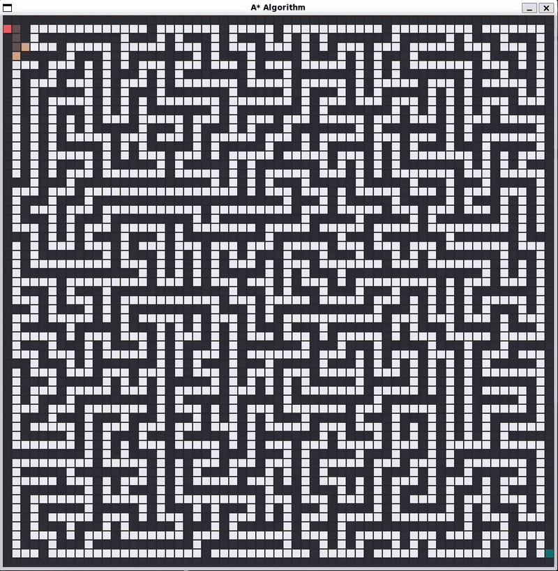

<h1 align="center">A* Algorithm</h1>

    

 

    
Table of Contents

    <ol>
        <li>
            <a href="#about-the-project">About The Project</a>
        </li>
        <li>
            <a href="#getting-started">Getting Started</a>
            <ul>
                <li>
                    <a href="#prerequisites">Prerequisites</a>
                    <ul>
                        <li>
                            <a href="#linux">Linux</a>
                        </li>
                    </ul>
                </li>
                <li>
                    <a href="#building-the-project">Building the Project</a>
                    <ul>
                        <li>
                            <a href="#linux-1">Linux</a>
                        </li>
                    </ul>
                </li>
            </ul>
        </li>
        <li>
            <a href="#usage">Usage</a>
            <ul>
                <li>
                    <a href="#configuration">Configuration</a>
                </li>
                <li>
                    <a href="#run">Run</a>
                </li>
            </ul>
        </li>
    </ol>

## About The Project
